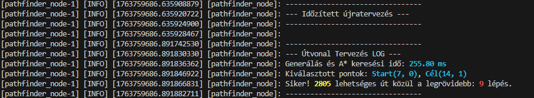
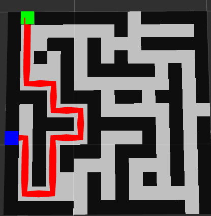
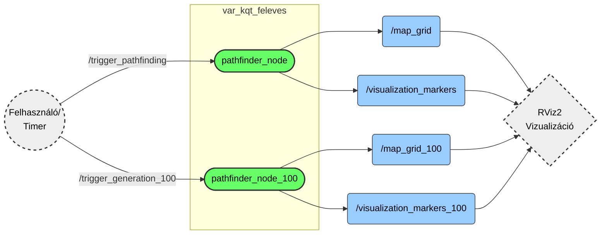
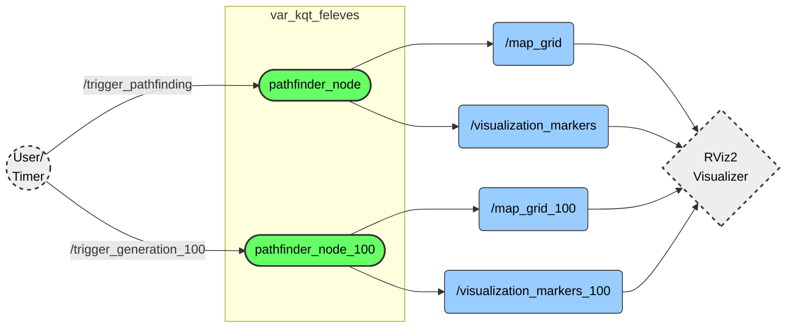

<div align="center">

# 🗺️ Útvonaltervező & Labirintus Generátor
### `var_kqt_feleves` ROS 2 Package

[](https://docs.ros.org/en/humble/)
[](https://docs.ros.org/en/jazzy/)
[](https://colcon.readthedocs.io/)
[](https://isocpp.org/)

**Automatizált labirintus-generálás és útvonalkereső algoritmusok vizualizációja.**

<h1>
<a href="#magyar">HU</a> &nbsp;&nbsp; • &nbsp;&nbsp; <a href="#english">EN</a>
</h1>

---
</div>

<a name="magyar"></a>

# HU Magyar

Ez a ROS 2 csomag (package) automatizált labirintus-generálást és különböző útvonalkereső algoritmusok vizualizációját valósítja meg. A rendszer moduláris felépítésű, lehetővé téve mind a kisméretű (15x15) oktatási célú demonstrációt, mind a nagyméretű (100x100) teljesítménytesztelést.

> **✅ Kompatibilitás:** A szoftver teljes mértékben kompatibilis a **ROS 2 Humble Hawksbill** és **ROS 2 Jazzy Jalisco** rendszerekkel.

## 📑 Tartalomjegyzék
1. [Funkciók & Képernyőképek](#-funkciók)
2. [Rendszerkövetelmények](#-rendszerkövetelmények)
3. [Telepítés](#-telepítés)
4. [Használat](#-használat)
5. [Konfiguráció](#-konfiguráció-és-paraméterek)
6. [Technikai Részletek](#-technikai-részletek)

---

## 🚀 Funkciók

### 📸 Képernyőképek

<div align="center">


<br>
<em>📷 Várható log kimenet színes formázással</em>
<br><br>


<br>
<em>📷 Automata generálás működés közben</em>
<br><br>


<br>
<em>📷 100x100-as "Stressz teszt" generálás</em>

</div>

### ✨ Főbb jellemzők
* 🧩 **Iteratív Labirintus Generálás:** *Recursive Backtracker* algoritmus stack-alapú implementációja, amely garantálja a tökéletes (körmentes) labirintust.
* ⚡ **A* (A-csillag) Keresés:** Heurisztikus útvonaltervezés a leggyorsabb eljutás érdekében.
* 🔍 **DFS (Depth-First Search):** Az összes lehetséges útvonal felkutatása (csak kis térképeken aktív).
* 👀 **Valós idejű Vizualizáció:** Integráció az **RViz2**-vel (OccupancyGrid térképek, útvonalak és jelölők megjelenítése).
* 📈 **Skálázhatóság:** Külön node dedikálva a nagy méretű (100x100-as) térképek generálására.

---

## 💻 Rendszerkövetelmények
* **ROS 2 Disztribúció:** Humble vagy Jazzy (Desktop telepítés ajánlott az RViz miatt)
* **Fordító:** C++17 kompatibilis fordító (g++)
* **Build rendszer:** colcon

---

## 🛠️ Telepítés

Kövesse az alábbi lépéseket a csomag forráskódból történő építéséhez:

1.  **Workspace-be lépés:**
    ```bash
    cd ~/ros2_ws/src
    ```
2.  **Repository klónozása:**
    ```bash
    git clone https://github.com/dzoli15/var_kqt_feleves
    ```
3.  **Fordítás:**
    ```bash
    cd ~/ros2_ws
    colcon build --packages-select var_kqt_feleves
    ```
4.  **Környezet betöltése:**
    ```bash
    source install/setup.bash
    ```

---

## 🎮 Használat
A csomag két fő futtatási móddal rendelkezik, amelyekhez előre konfigurált launch fájlok tartoznak. Ezek elindítják a számítási node-ot és a vizualizációt (RViz2) is.

### 1. 🎓 Útvonaltervező mód
Ez a mód egy 15x15-ös labirintust generál, kijelöl egy Start és Cél pontot, majd megkeresi a legrövidebb utat.
* **Jellemzők:** A* keresés, Összes út keresés (DFS), Részletes vizualizáció (piros vonal).
* **Indítás:**
    ```bash
    ros2 launch var_kqt_feleves pathfinder_basic.launch.py
    ```

### 2. 🏗️ Nagy méretű map generálása (Stressz teszt)
Ez a mód nagy méretű labirintusok gyors generálására szolgál. Az útvonalkeresés le van tiltva a számítási kapacitás megőrzése érdekében.
* **Jellemzők:** 100x100-as méret, OccupancyGrid vizualizáció.
* **Indítás:**
    ```bash
    ros2 launch var_kqt_feleves map_100.launch.py
    ```

### 🕹️ Manuális Vezérlés
Ha az `automatic_mode` paramétert `false`-ra állítja, a generálás nem indul el magától. Ilyenkor ROS 2 Service hívásokkal vezérelheti a folyamatot.

**Kis tervező indítása:**
```bash
ros2 service call /trigger_pathfinding std_srvs/srv/Trigger {}
```
**Nagy tervező indítása:**
```bash
ros2 service call /trigger_generation_100 std_srvs/srv/Trigger {}
```

---

## ⚙️ Konfiguráció és Paraméterek

| Paraméter | Típus | Alapérték | Leírás |
| :--- | :---: | :---: | :--- |
| `map_size` | int | 15 / 100 | A labirintus oldalhossza cellákban. *(Lásd: Technikai Részletek)* |
| `automatic_mode` | bool | `true` | **true:** Időzítővel folyamatosan újragenerál.<br>**false:** Várakozik a service hívásra. |

**Példa paraméter felülbírálása indításkor:**
```bash
ros2 run var_kqt_feleves pathfinder_node_100 --ros-args -p map_size:=50 -p automatic_mode:=false
```

---

## 🧠 Technikai Részletek

### 📐 Méretkorrekció (Páros vs. Páratlan)
A Recursive Backtracker algoritmus rács-alapú működése (Fal-Út-Fal struktúra) matematikai okokból **páratlan méretű** rácsot igényel a zárt keretek biztosításához.
> ⚠️ **FONTOS:** Ha a felhasználó **páros** számot ad meg (pl. 100), a rendszer automatikusan **+1-gyel megnöveli** a méretet (101-re). Ez a stabilitást biztosító funkció.

### 🛡️ Algoritmusok szétválasztása
A 100x100-as módban a rekurzív útvonalkereső (DFS) algoritmusok le vannak tiltva.
* **Ok:** Ekkora méretnél a lehetséges útvonalak száma exponenciálisan nő.
* **Veszély:** A rekurzív hívások **Stack Overflow**-t és összeomlást okoznának.
* **Megoldás:** A `PathfinderNode100` kizárólag generálásra és térkép-publikálásra optimalizált.

### 📡 Node Architektúra & Topicok



<br>
<br>
<hr>
<br>
<br>

<a name="english"></a>

# EN English

This ROS 2 package implements automated maze generation and visualization of various pathfinding algorithms. The system is modular, allowing for both small-scale (15x15) educational demonstrations and large-scale (100x100) performance testing.

> **✅ Compatibility:** The software is fully compatible with **ROS 2 Humble Hawksbill** and **ROS 2 Jazzy Jalisco** systems.

## 📑 Table of Contents
1. [Features & Screenshots](#-features)
2. [System Requirements](#-system-requirements)
3. [Installation](#-installation)
4. [Usage](#-usage)
5. [Configuration](#-configuration-and-parameters)
6. [Technical Details](#-technical-details)

---

## 🚀 Features

### 📸 Screenshots

<div align="center">


<br>
<em>📷 Expected Log Output</em>
<br><br>


<br>
<em>📷 Auto Generation in Action</em>
<br><br>


<br>
<em>📷 100x100 "Stress Test" Maze</em>

</div>

### ✨ Key Features
* 🧩 **Iterative Maze Generation:** Stack-based implementation of the *Recursive Backtracker* algorithm, guaranteeing a perfect (loop-free) maze.
* ⚡ **A* (A-Star) Search:** Heuristic pathfinding for the fastest route.
* 🔍 **DFS (Depth-First Search):** Exploring all possible paths (active only on small maps).
* 👀 **Real-time Visualization:** Integration with **RViz2** (displaying OccupancyGrid maps, paths, and markers).
* 📈 **Scalability:** A dedicated node for generating large-scale (100x100) maps.

---

## 💻 System Requirements
* **ROS 2 Distribution:** Humble or Jazzy (Desktop installation recommended for RViz).
* **Compiler:** C++17 compatible compiler (g++).
* **Build System:** colcon.

---

## 🛠️ Installation

Follow the steps below to build the package from source:

1.  **Enter Workspace:**
    ```bash
    cd ~/ros2_ws/src
    ```
2.  **Clone Repository:**
    ```bash
    git clone https://github.com/dzoli15/var_kqt_feleves
    ```
3.  **Build:**
    ```bash
    cd ~/ros2_ws
    colcon build --packages-select var_kqt_feleves
    ```
4.  **Load Environment:**
    ```bash
    source install/setup.bash
    ```

---

## 🎮 Usage
The package has two main execution modes, which come with pre-configured launch files. These start both the computation node and the visualization (RViz2).

### 1. 🎓 Pathfinder Mode
This mode generates a 15x15 maze, selects a Start and Goal point, and then finds the shortest path.
* **Features:** A* search, All paths search (DFS), Detailed visualization (red line).
* **Launch:**
    ```bash
    ros2 launch var_kqt_feleves pathfinder_basic.launch.py
    ```

### 2. 🏗️ Large Map Generation (Stress Test)
This mode is designed for the rapid generation of large-scale mazes. Pathfinding is disabled in this mode to conserve computational capacity.
* **Features:** 100x100 size, OccupancyGrid visualization.
* **Launch:**
    ```bash
    ros2 launch var_kqt_feleves map_100.launch.py
    ```

### 🕹️ Manual Control
If the `automatic_mode` parameter is set to `false`, generation will not start automatically. In this case, you can control the process using ROS 2 Service calls.

**Start Small Pathfinder:**
```bash
ros2 service call /trigger_pathfinding std_srvs/srv/Trigger {}
```
**Start Large Generator:**
```bash
ros2 service call /trigger_generation_100 std_srvs/srv/Trigger {}
```

---

## ⚙️ Configuration and Parameters

| Parameter | Type | Default | Description |
| :--- | :---: | :---: | :--- |
| `map_size` | int | 15 / 100 | Side length of the maze in cells. *(See: Technical Details)* |
| `automatic_mode` | bool | `true` | **true:** Continuously regenerates using a timer.<br>**false:** Waits for a service call. |

**Example of overriding parameters at startup:**
```bash
ros2 run var_kqt_feleves pathfinder_node_100 --ros-args -p map_size:=50 -p automatic_mode:=false
```

---

## 🧠 Technical Details

### 📐 Size Correction (Even vs. Odd)
The Recursive Backtracker algorithm's grid-based operation (Wall-Path-Wall structure) requires an **odd-sized** grid for mathematical reasons to ensure closed borders.
> ⚠️ **IMPORTANT:** If the user provides an **even** number (e.g., 100), the system automatically **increases the size by 1** (to 101). This is a feature ensuring algorithm stability.

### 🛡️ Separation of Algorithms
In the 100x100 mode, recursive pathfinding (DFS) algorithms are disabled.
* **Reason:** At such a scale, the number of possible paths increases exponentially.
* **Risk:** Recursive calls would cause a **Stack Overflow** and crash the program.
* **Solution:** `PathfinderNode100` is optimized strictly for generation and map publishing.

### 📡 Node Architecture & Topics


